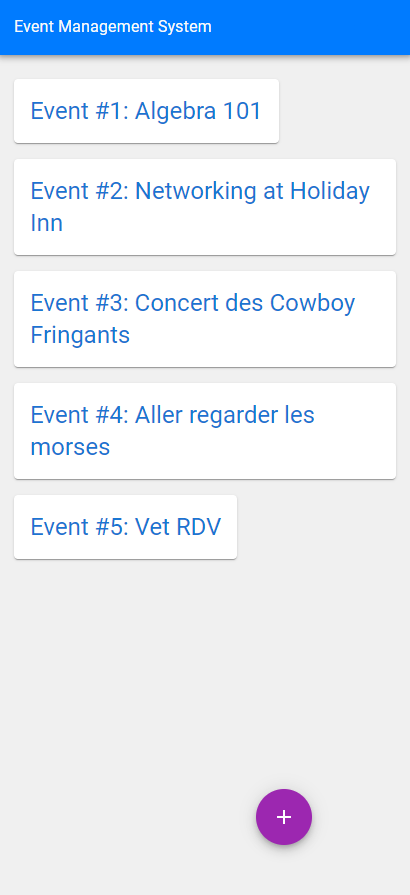

# HRCom Crud App

## Description

The HRCom Crud App is a simple application that handles real-life events. Users can create and list events through a user-friendly interface. The backend is built with Express and serves as a REST API, while the frontend is developed using React Vite. It's a CRUD application, but with only Create and Read operations implemented.

The application also includes a suite of tests built with Jest.

## Screenshots




## Installation

### Prerequisites

- Node.js v16
- MongoDB v5.0 with a database named "hrcom"

### Backend API

To install and run the backend API, follow these steps:

1. Navigate to the `api` directory:
```bash
cd api
```
2. Install the necessary packages:
```bash
npm install
```
3. Start the server:
```bash
node -r dotenv/config bin/www
```
4. (Optional) To run the tests for the API, use the following command:
```bash
npm run test
```

### Frontend App

To install and run the frontend app, follow these steps:

1. Navigate to the `app` directory:
```bash
cd app
```
2. Install the necessary packages:
```bash
npm install
```
3. Start the server:
```bash
npm run start
```
4. (Optional) To run the tests for the App, use the following command:
```bash
npm run test
```
## Usage

After starting both the backend API and the frontend application, you can use the app to create and list events.

## Contributing

This project was meant to be completed in 4 hours, so there are definitely some work-in-progress elements. These include debugging the tests, creating a database startup script to run indexes and insert dummy data, cleaning up modules in package.json, improving state management in React, and fixing basic errors showing up in the console.

There were many shortcuts used in order to achieve the objective in 4 hours, so some refactoring is in order, especially for components and styles on the frontend. Contributions are welcome! Please feel free to submit a pull request.

## License

This project is licensed under the terms of the MIT license.

## Contact

If you have any questions or issues, please open an issue in this repository.
